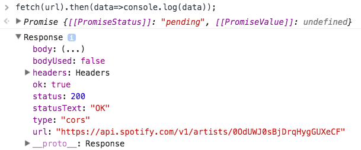
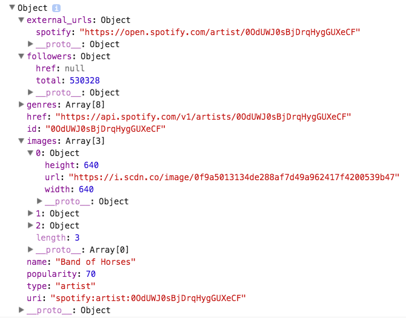
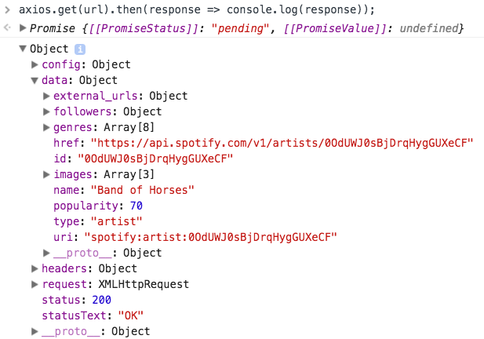
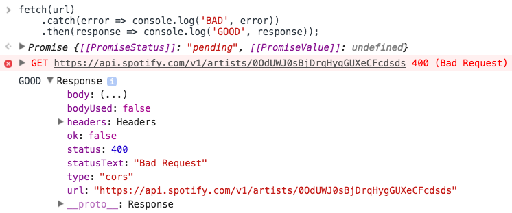

# Генерация HTTP-запросов

Fetch или Axios.js

*Перевод «[Fetch vs. Axios.js for making http requests](https://medium.com/p/2b261cdd3af5)» Джейсона Арнольда.*

*Какой хороший пёсик!*

В одном из заключительных разделов курса [*ES6 Javascript: The Complete Developer’s Guide](https://www.udemy.com/javascript-es6-tutorial/learn/v4/overview)* на *Udemy* Стефан Гридер рассказывает о методе fetch() и о некоторых его недостатках. Он отмечает, что реализация fetch() не идеальна и предлагает другие варианты для выполнения *HTTP*-запросов. Один из таких вариантов — [*Axios](https://www.npmjs.com/package/axios)*. Раньше я даже не слышал об *Axios* и подумал, что подвернулась отличная возможность, чтобы немного покопаться и изучить его. Поскольку это ссылка на материал из курса Стивена, я использую похожие примеры.

*Axios* — это *JavaScript*-библиотека для выполнения либо *HTTP*-запросов в *Node.js,* либо XMLHttpRequests в браузере. Она поддерживает промисы — новинку *ES6*. Одна из особенностей, которая делает её лучше fetch() — автоматические преобразования *JSON*-данных.

При использовании fetch() для передачи данных в *JSON,* необходимо выполнить процесс в два этапа. Сначала сделать фактический запрос, а затем вызвать метод json() для полученных данных с сервера.

***Обновление:** по состоянию на 29 мая, Spotify теперь требует проверки подлинности для всех запросов к их API, поэтому примеры ниже не будут работать корректно.*

Вот простой пример c использованием *API Spotify*. Установим *URL* в качестве переменной и передадим её в fetch(). Затем установим колбэк, выводящий в консоль данные в качестве аргумента then().

    const url = 'https://api.spotify.com/v1/artists/ID';

    fetch(url)
      .then(data => console.log(data));

*Ответ метода fetch() по умолчанию.*

Это конечно здорово, но это не те данные, которые мы бы хотели увидеть. Этот ответ сервера сообщил нам, что наш запрос прошел просто отлично. Круто, но мы больше не можем ничего с этим сделать.

Чтобы получить данные, сперва нужно передать их в метод json().

    fetch(url)
      .then(response => response.json())
      .then(data => console.log(data));

*Результат после передачи в json().*

Теперь это те данные, которые мы хотели получить. Попробуем реализовать это через *Axios*. Первый шаг — установка. Существует несколько вариантов установки:

Либо *npm*, либо *bower*:

    $ npm install axios
    $ bower install axios

Либо прямо с *CDN*:

    

Затем, прямо в консоли, устанавливаем *URL* в качестве переменной и передаем его в метод axios.get().

    const url = 'https://api.spotify.com/v1/artists/ID'

    axios.get(url)
      .then(response => console.log(response));

Таким образом, с помощью *Axios* можно обойтись без передачи результатов *HTTP*-запроса в метод json(). *Axios* возвращает именно тот объект с данными, который мы ожидаем.

Второй вопрос, который Стивен поднимает: как fetch() обрабатывает ответы на ошибки. Логически можно предположить, что если метод fetch() возвращает сообщение об ошибке, то управление переходит в блок catch() и ошибка обрабатывается там, верно? Не совсем. Вот пример.

Изменим переменную url из предыдущих примеров на некорректную. Ожидается, что ошибка 400 из метода then() перейдёт в блок сatch(), но этого не происходит.

    const url = '[https://api.spotify.com/v1/artists/WRONG'](https://api.spotify.com/v1/artists/0OdUWJ0sBjDrqHygGUXeCFcdsds');

    fetch(url)
      .catch(error => console.log('BAD', error))
      .then(response => console.log('GOOD', response));

Для наглядности выведем в консоль BAD в случае, если ошибка обрабатывается в блоке catch(), в противном случае выведем GOOD.

Получаем код ответа 400, но, как вы можете видеть по строке GOOD в консоли, выполнился then(). Как же *Axios* справляется с этим? Так, как мы и ожидали: выполняется блок сatch() и мы получаем необходимый нам вид ошибки.

Строка BAD и ошибка выводятся в консоль.

Метод fetch() — огромный шаг в развитии нативного *JS* в сторону взаимодействия с сервером. Но он имеет свои недостатки, которых можно избежать, используя сторонние библиотеками, такие как *Axios*.

## *Примечания переводчика*

Метод fetch() по умолчанию не работает с куками. Для этого необходимо выставить значение credentials

    fetch('url', { credentials: 'same-origin' });

*Перевод [Артура Храброва](https://medium.com/@nzvtrkk), редактура [Вадима Макеева](https://medium.com/@pepelsbey).*
